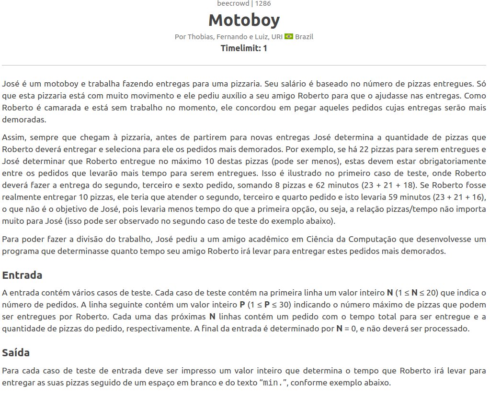
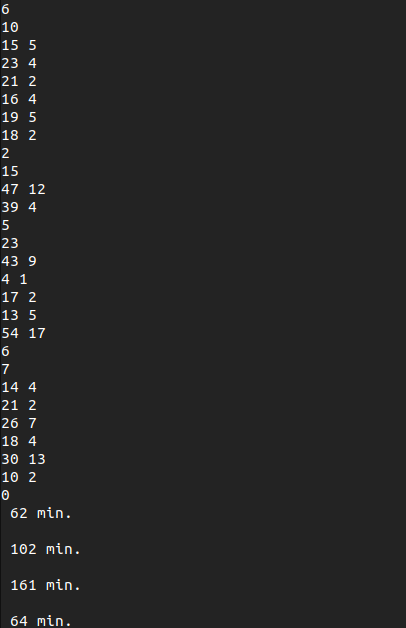

# Greed_Dupla14

**Número da Lista**: 3 
**Conteúdo da Disciplina**: Greed 

## Alunos

|Matrícula | Aluno |
| -- | -- |
| 14/0156909  | [Nathalia Lorena Cardoso](https://github.com/Natilorens) |
| 16/0006210 | [Francisco Heronildo](https://github.com/FranciscoHeronildo) |

## Sobre

O objetivo desse projeto é mostrar a utilização do algoritmo ambiciosso _Knapsack_ resolvendo dois problemas selecionados no [beecrowd](https://www.beecrowd.com.br/):

- [1286](https://www.beecrowd.com.br/judge/pt/problems/view/1286)
- [1288](https://www.beecrowd.com.br/judge/pt/problems/view/1288)

## Screenshots

- 1286:

- 1288:

## Instalação

**Linguagem**: Python3 e C++ 
**Framework**: Nenhuma 
**Sistema Operacional Indicado**: Ubuntu e derivados
<!-- Descreva os pré-requisitos para rodar o seu projeto e os comandos necessários. -->

## Uso

Via _Terminal_ siga os passas abaixo 

Clone o Repositório: 
`$ git clone https://github.com/projeto-de-algoritmos/Greed_Dupla14.git`

Acesse o diretório: 
`$ cd src/`

Execute o primeiro Problema: 
`$ python3 1286.py` 

Execute o segundo Problema: 
`$ g++ 1288.cpp -o 1288`  
`$ ./1288`

<!-- ## Outros
Quaisquer outras informações sobre seu projeto podem ser descritas abaixo. -->
